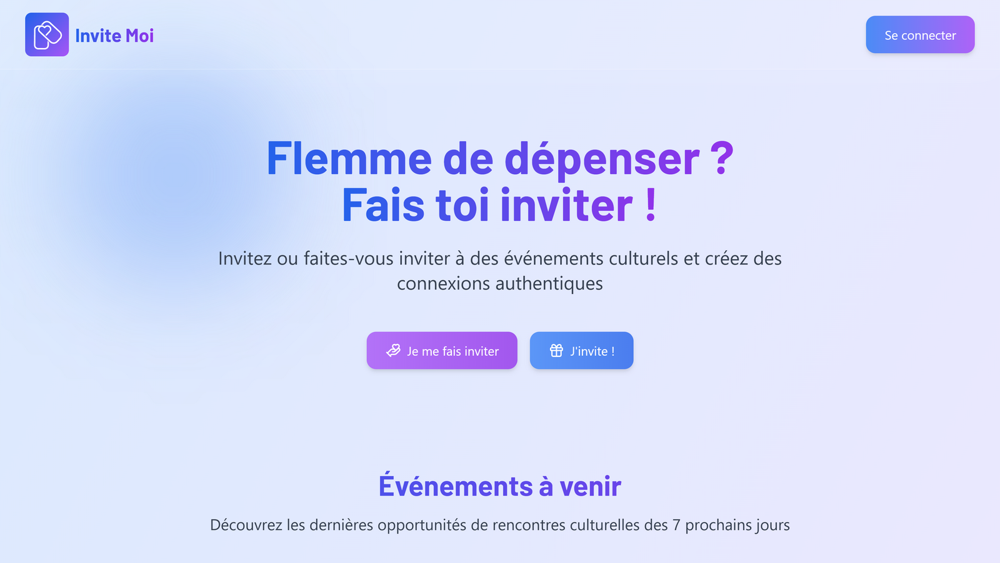
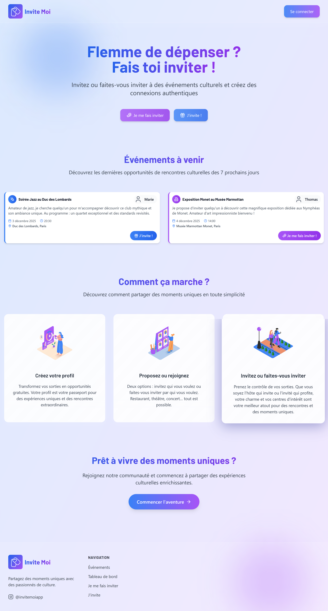
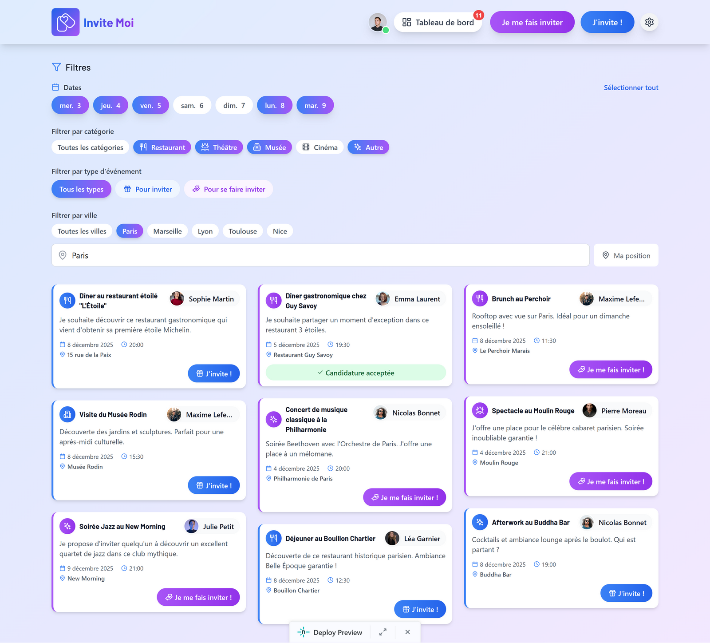
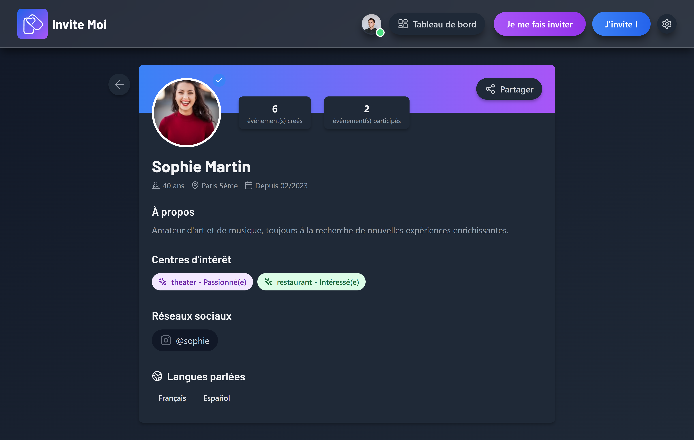

#  InviteMoi - Case Study

> Portfolio complet d'une plateforme sociale innovante de partage d'expériences culturelles

**🔗 Démo en ligne :** [invitemoi.netlify.app](https://deploy-preview-1--invitemoi.netlify.app/events)

<div align="center">
  
  <br/>
  <em>Page d'accueil de l'application</em>
</div>

---

## 📑 Sommaire

- [📊 Analyse de Marché](#-analyse-de-marché)
- [👋 Contexte](#-contexte)
- [📸 Aperçu de l'Application](#-aperçu-de-lapplication)
- [🔍 Contenu du Portfolio](#-contenu-du-portfolio)
- [🚀 Innovations Produit](#-innovations-produit)
  - [1. Gestes Swipe : Fonctionnalité Cachée](#1-gestes-swipe--une-fonctionnalité-cachée-à-découvrir)
  - [2. Double Système Host/Guest](#2-double-système-hostguest)
  - [3. Profils Sociaux Enrichis](#3-profils-sociaux-enrichis)
  - [4. Notifications Temps Réel](#4-notifications-temps-réel-intelligentes)
  - [5. Design Glassmorphism](#5-design-glassmorphism--animations)
  - [6. Géolocalisation](#6-géolocalisation--autocomplete)
- [🆚 Positionnement Marché](#-positionnement-marché)
- [🛠️ Stack Technique](#️-stack-technique)
- [📊 Architecture Technique](#-architecture-technique)
- [📉 Résultats & Learnings](#-résultats--learnings--un-échec-instructif)
- [🚀 Roadmap V2](#-roadmap-v2--vision-monétisation)

---

## 📊 Analyse de Marché

### Le Problème des Plateformes Sociales Actuelles

Les applications de rencontre et d'événements souffrent des mêmes problèmes systémiques :

**Choice Overload**
- L'abondance d'options est contre-productive
- Les utilisateurs passent plus de temps à chercher qu'à vivre des expériences
- Paradoxe du choix : plus d'options = moins de satisfaction

**Time-Consuming**
- Les millennials passent **10h/semaine** sur les apps de rencontre
- Temps perdu en swipes infinis sans résultats concrets
- Fatigue décisionnelle accrue

**Bad Matching**
- Algorithmes généralistes qui ne comprennent pas les nuances
- Profils incomplets ou trompeurs
- Déconnexion entre attentes et réalité

### L'Opportunité de Marché

| Indicateur | Valeur | Source |
|-----------|--------|--------|
| **Budget annuel/utilisateur** | $243/an | Industrie dating online |
| **Marché social apps** | $3B+ annuel | Croissance continue |
| **Adoption prévue** | 50%+ des connexions en ligne d'ici 2031 | Tendance démographique |

**Application à InviteMoi :**

Ces problèmes s'appliquent directement aux plateformes d'événements culturels :
- **Meetup** : Trop d'événements, filtrage difficile
- **Eventbrite** : Liste interminable sans personnalisation
- **Facebook Events** : Noyé dans le bruit social

### La Différence InviteMoi

> **"This is not a dating app"** - mais les principes de connexion humaine authentique s'appliquent.

InviteMoi résout ces problèmes par :

1. **Curation par l'intention** : Les événements ont un contexte (seeking/offering)
2. **Swipe ciblé** : Pas de choix infini, l'hôte décide
3. **Engagement limité** : Pas de scroll infini, focus sur la qualité
4. **Profils enrichis** : Centres d'intérêt, langues, social links = meilleur matching

---

## 👋 Contexte

**InviteMoi** est une plateforme sociale révolutionnaire qui transforme la façon dont les gens partagent des expériences culturelles. L'application permet aux utilisateurs de :

- **Se faire inviter** → Profiter d'événements culturels sans dépenser
- **Inviter quelqu'un** → Offrir des expériences et créer des connexions authentiques
- **Gérer les candidatures** → Interface intuitive avec gestes cachés à découvrir
- **Construire son profil social** → Centres d'intérêt, langues, liens sociaux

### 🎯 La différence InviteMoi

Contrairement aux applications d'événements classiques (Meetup, Eventbrite), InviteMoi introduit un **double système unique** :

- **"Je cherche un hôte"** : Vous créez un événement et quelqu'un vous invite
- **"Je propose d'inviter"** : Vous proposez d'inviter quelqu'un à un événement

Ce système inversé crée une **dynamique sociale innovante** où les rôles sont flexibles et où chacun peut à la fois offrir et recevoir.

Ce repo documente mon travail sur ce produit :
- Vision produit et positionnement marché
- Personas utilisateurs
- Architecture fonctionnelle
- Fonctionnalités innovantes
- Design UX/UI différenciant
- KPIs et mesure d'impact

---

## 📸 Aperçu de l'Application

<div align="center">
  
  <br/>
  <em>Landing page de l'application</em>
  <br/><br/>
  
  <br/>
  <em>Interface de navigation et découverte des événements</em>
</div>

---

## 🔍 Contenu du Portfolio

Les documents détaillés se trouvent dans le dossier [`docs/`](./docs).

- **[01 - Vision Produit](./docs/01-vision-produit.md)**
  Problème, solution, proposition de valeur unique

- **[02 - Personas](./docs/02-personas.md)**
  Profils utilisateurs, motivations, pain points

- **[03 - Architecture Fonctionnelle](./docs/03-architecture-fonctionnelle.md)**
  Modules, flux utilisateur, choix d'architecture

- **[04 - Innovation UX](./docs/04-innovation-ux.md)**
  Système de swipe, double flux, notifications temps réel

- **[05 - Post-Mortem & Learnings](./docs/05-post-mortem.md)**
  Analyse honnête de l'échec, causes, learnings pour futurs projets

---

## 🚀 Innovations Produit

### 1. Gestes Swipe : Une Fonctionnalité Cachée à Découvrir

**Approche "Hidden Feature" inspirée de Snapchat** : Pas de tutoriel, pas d'onboarding intrusif.

L'utilisateur découvre naturellement qu'il peut swiper sur les candidatures :

- **Swipe droite** → Accepter la candidature (animation verte)
- **Swipe gauche** → Refuser poliment (animation rouge)
- **Boutons visibles** → Pour ceux qui ne découvrent pas les gestes, les boutons "Accepter/Refuser" restent disponibles
- **Feedback immédiat** → Animations fluides qui valident l'action

```
[Photo candidat] → Swipe intuitif → [Animation] → [Notification envoyée]
              OU
[Photo candidat] → Boutons classiques → [Même résultat]
```

**Pourquoi cette approche "découverte" :**
- **Pas de friction** : Zéro onboarding, zéro tutoriel forcé
- **Plaisir de la découverte** : L'utilisateur se sent malin en trouvant le raccourci
- **Double accessibilité** : Gestes pour les power users, boutons pour les autres
- **Effet "wow"** : Première application d'événements culturels avec gestes natifs cachés
- **Mobile-first** : Les gestes sont naturels sur mobile (80% des utilisateurs)

### 2. Double Système Host/Guest

**Inversion unique des rôles** par rapport aux plateformes traditionnelles :

| Mode | Rôle | Attente |
|------|------|---------|
| **Seeking Host** | Je cherche quelqu'un qui m'invite | Recevoir des propositions d'hôtes |
| **Offering Host** | Je propose d'inviter quelqu'un | Recevoir des candidatures d'invités |

**Avantage concurrentiel :**
- Supprime le stigmate du "je cherche quelqu'un pour payer"
- Permet aux généreux de s'affirmer comme tels
- Crée une économie d'attention équilibrée
- Chacun peut jouer les deux rôles selon le contexte

### 3. Profils Sociaux Enrichis

Au-delà du nom et de la photo, InviteMoi propose :

- **Centres d'intérêt** : Musique, art, cinéma, gastronomie...
- **Langues parlées** : Facilite les connexions internationales
- **Liens sociaux** : Instagram, Twitter (partage conditionnel)
- **Statistiques** : Événements créés, participations, taux d'acceptation

**Impact sur le matching :**
- Meilleure qualité des connexions
- Réduction du ghosting (profils transparents)
- Confiance accrue entre utilisateurs

### 4. Notifications Temps Réel Intelligentes

Système de notifications contextuelles par onglet :

- **Badge rouge** sur "Mes événements" → Nouvelles candidatures
- **Badge rouge** sur "Mes candidatures" → Acceptations reçues
- **Highlight animation** → Nouvel événement créé (2s)
- **Notifications email** → Changements de statut importants

**Différenciation :**
- Pas de spam : notifications ciblées uniquement
- Intelligence contextuelle : badge uniquement si actionnable
- Multi-canal : in-app + email pour événements critiques

### 5. Design Glassmorphism & Animations

Interface moderne avec :

- **Glass effect** : Effet de verre dépoli sur les cartes
- **Gradients dynamiques** : Transitions de couleur fluides
- **Micro-animations** : Feedback visuel sur chaque action
- **Dark mode** : Support natif avec transitions douces
- **Framer Motion** : Animations performantes et élégantes

<div align="center">
  
  
  <br/>
  <em>Menu mobile avec animations fluides • Gestes swipe cachés à découvrir (hidden feature)</em>
</div>

**Mode Sombre :**

<div align="center">
  
  <br/>
  <em>Interface complète en dark mode avec effets glassmorphism préservés</em>
</div>

**Objectif :**
- Se démarquer des interfaces plates et ennuyeuses
- Créer une expérience premium et moderne
- Augmenter l'engagement par le plaisir visuel

### 6. Géolocalisation & Autocomplete

- **Autocomplete d'adresses** : Powered by Google Places API
- **Filtres par ville** : Recherche d'événements géolocalisés
- **Affichage carte** : Visualisation des lieux d'événements
- **Distance intelligente** : Suggestions basées sur la proximité

---

## 🆚 Positionnement Marché

### vs Meetup

| Critère | Meetup | InviteMoi |
|---------|--------|-----------|
| **Modèle** | Événements de groupe | Connexions 1-to-1 |
| **Paiement** | Chacun paie | Un invite l'autre |
| **Matching** | Inscription libre | Validation par l'hôte |
| **Social** | Communautés | Relations directes |
| **Innovation** | ❌ | Swipe + double flux |

### vs Tinder

| Critère | Tinder | InviteMoi |
|---------|--------|-----------|
| **Objectif** | Rencontres romantiques | Expériences culturelles |
| **Matching** | Match mutuel requis | Hôte décide |
| **Contenu** | Profil + bio | Événement + profil |
| **Système** | Swipe bidirectionnel | Swipe unidirectionnel (hôte) |
| **Value** | Date | Culture + connexion |

**Conclusion :** InviteMoi occupe un **espace blanc** entre le social networking (Meetup) et le dating (Tinder), en créant une catégorie nouvelle : **le cultural networking avec économie de générosité**.

---

## 🛠️ Stack Technique

### Frontend
- **React 18** + **TypeScript** + **Vite** (build ultra-rapide)
- **Tailwind CSS** (utility-first, design system cohérent)
- **Framer Motion** (animations fluides)
- **React Router** (navigation SPA)
- **@use-gesture/react** (gestures swipe natifs)

### Backend & Services
- **Supabase** (Auth, Database PostgreSQL, Storage, Edge Functions)
- **Netlify** (Hosting + Serverless Functions)
- **Nodemailer** (Email notifications)
- **Google Places API** (Autocomplete adresses)

### State & Utils
- **Context API** (AuthContext, EventContext, NotificationContext)
- **Custom Hooks** (useDashboardNotifications, useEventOperations)
- **date-fns** (manipulation dates, i18n français)
- **clsx** (conditional CSS classes)

### Ampleur du Projet

- **12k lignes de code** dans `src/`
  - TypeScript (.ts) : 4k lignes
  - TypeScript React (.tsx) : 8k lignes
  - **100+ fichiers** TS/TSX

---

## 📊 Architecture Technique

### Flux Utilisateur Principal

```
[Landing] → [Inscription] → [Création Profil]
    ↓
[Feed Événements] → [Application] → [Notification]
    ↓
[Dashboard Hôte] → [Swipe Candidature] → [Accept/Reject]
    ↓
[Match] → [Échange contacts] → [Événement réalisé]
```

### Structure des Données

```typescript
type EventType = 'seeking-host' | 'offering-host'

interface Event {
  id: string
  title: string
  description: string
  category: 'restaurant' | 'theater' | 'museum' | 'cinema' | 'other'
  date: string
  time: string
  location: string
  eventType: EventType
  applicants: Application[]
  status: 'open' | 'matched' | 'completed'
}

interface Application {
  user: User
  message: string
  timestamp: string
  status: 'pending' | 'accepted' | 'rejected'
  sharedSocialLinks: string[]
}
```

### Modules Principaux

- **Auth Module** : Sign-in, Sign-up, Google OAuth, Reset password
- **Event Module** : Create, Read, Filter, Apply, Accept/Reject
- **Profile Module** : Edit profile, Interests, Languages, Social links
- **Dashboard Module** : My events, My applications, Notifications
- **Notification Module** : Real-time badges, Email alerts

---

## 📉 Résultats & Learnings : Un Échec Instructif

### Constat d'Échec

**InviteMoi n'a pas atteint son product-market fit** malgré une innovation UX forte et une execution technique solide.

### Pourquoi le Projet a Échoué

[Voir analyse post-mortem](./docs/05-post-mortem.md)

---

## 🚀 Roadmap V2 - Vision Monétisation

Bien que le projet n'ait pas atteint son PMF, une roadmap claire avait été définie pour transformer InviteMoi en plateforme viable économiquement.

### Modèle de Monétisation : Affiliation Lieux Culturels

**Concept :** Partenariats avec restaurants, théâtres, musées et cinémas qui paient pour être mis en avant lors de la création d'événements.

#### Comment ça marche ?

1. **Lieux Premium Partenaires**
   - Badge "Partenaire InviteMoi" sur les suggestions d'adresses
   - Mise en avant dans l'autocomplete Google Places
   - Apparition prioritaire dans les recommandations géolocalisées

2. **Modèle de Revenus**
   - **Commission par réservation** : 5-10% sur les réservations confirmées via l'app
   - **Abonnement mensuel** : Forfait fixe pour visibilité garantie (€99-299/mois)
   - **Pay-per-click** : Lieux payent pour chaque clic sur leur profil

3. **Valeur pour les Lieux**
   - Accès à une audience qualifiée (personnes cherchant des sorties culturelles)
   - Visibilité auprès d'organisateurs d'événements généreux
   - Tracking ROI : nombre de clics, réservations, taux de conversion

4. **Valeur pour les Utilisateurs**
   - Découverte de lieux de qualité vérifiés
   - Offres exclusives partenaires (réductions, menus spéciaux)
   - Expérience premium sans payer (financée par les lieux)

### Map Interactive Géolocalisée (V2)

**Fonctionnalité :** Carte interactive pour découvrir visuellement les événements et lieux autour de soi.

#### Features

- **Vue carte** : Visualisation des événements à proximité sur une carte interactive
- **Filtres géographiques** : Recherche par rayon (500m, 1km, 5km, 10km+)
- **Marqueurs dynamiques** : Différenciation visuelle (seeking-host vs offering-host)
- **Clusters intelligents** : Regroupement automatique des événements proches
- **Lieux partenaires** : Badge spécial sur la carte pour les partenaires premium

#### Stack Technique Envisagé

- **Mapbox GL JS** ou **Google Maps API** (décision selon coûts)
- **Geolocation API** : Détection position utilisateur
- **PostGIS** : Extension PostgreSQL pour requêtes géospatiales performantes
- **Clustering** : Algorithme Supercluster pour performances mobile

#### Impact Attendu

- **+40% engagement** : Exploration visuelle vs liste textuelle
- **+25% découvrabilité lieux** : Utilisateurs découvrent événements hors zone habituelle
- **Meilleur matching** : Géolocalisation précise réduit frictions logistiques

---

### Compétences Démontrées

- ✅ **Vision produit** : Identification d'un espace blanc marché (cultural networking)
- ✅ **Innovation UX** : Introduction du swipe dans un contexte non-dating
- ✅ **Analyse concurrentielle** : Positionnement clair vs Meetup/Tinder
- ✅ **Architecture produit** : Double flux innovant (seeking/offering)
- ✅ **Honnêteté intellectuelle** : Capacité à analyser un échec sans excuse
- ✅ **Learnings actionnables** : Compréhension des défis des plateformes à deux côtés

### Compétences Transverses

- ✅ **Double casquette** : Capacité à designer ET implémenter
- ✅ **User-centric** : Chaque feature répond à un pain point identifié
- ✅ **Design thinking** : Interface moderne et engageante (glassmorphism)
- ✅ **Maturité** : Acceptation de l'échec et focus sur les learnings

